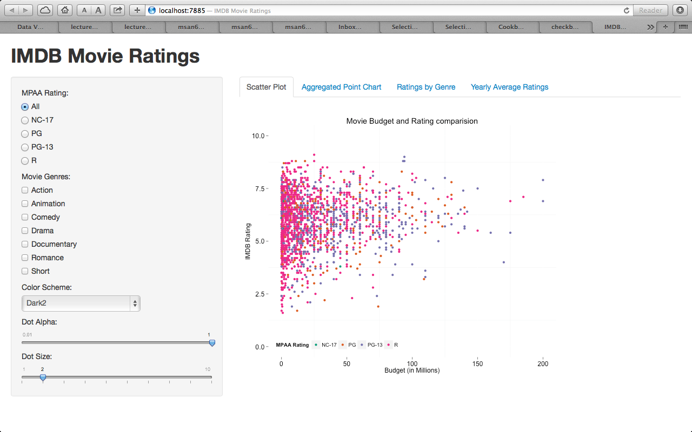
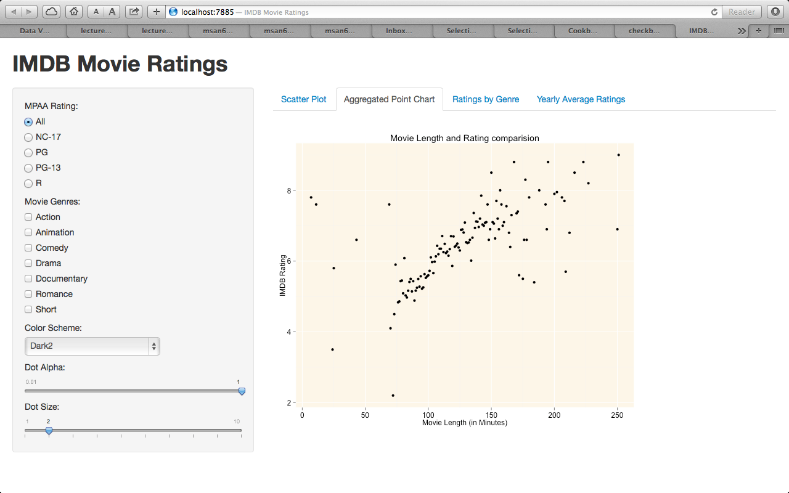
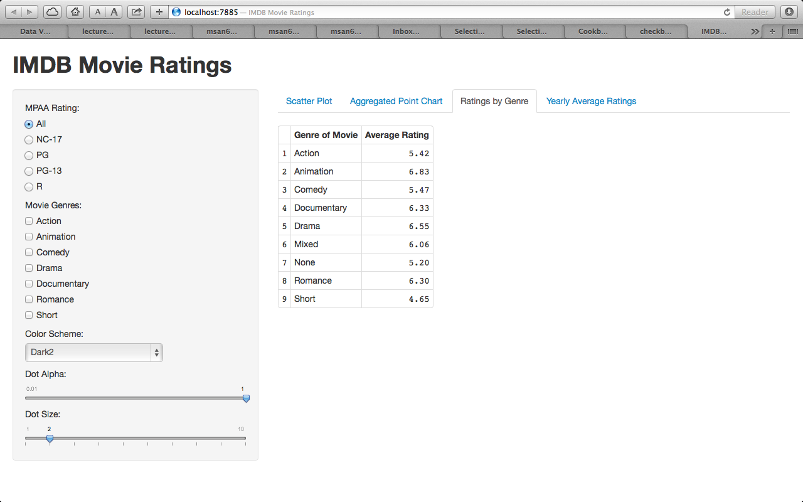
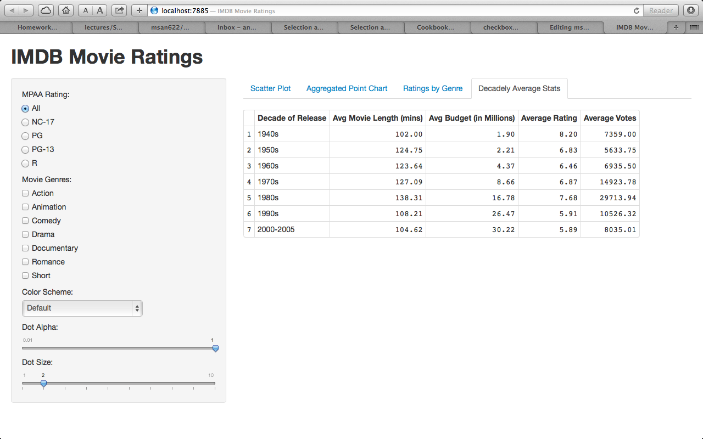

Watching Movie trends
=====================

| **Name**  | Anuj Saxena  |
|----------:|:-------------|
| **Email** | anujsaxenaa@gmail.com |

Live Version:- https://anujsaxenaa.shinyapps.io/InternetMovieDataViz

## Instructions ##

The following packages must be installed prior to running this code:

- `ggplot2`
- `shiny`

To run this code, please enter the following commands in R:

```
library(shiny)
shiny::runGitHub('ShinyApplications', 'anujsaxenaa', subdir='InternetMovieDataViz')
```

This will start the `shiny` app. See below for details on how to interact with the visualization.

## Discussion ##
##Scatter Plot##

We can use radio buttons to look at different movies based on their MPAA rating. We can also filter the movies based on what
genre we want to look at.
##Aggregated Point Chart##

I was interested in know if the length of the Movie has a relationship with the IMDB rating. I aggregated the data on the length of the movie and plotted a scatter plot to see the relationship. I found there to be a positive correlation between the Ratings and Movie length. 

##Ratings by Genre##

I was interested in looking at average IMDB ratings by specific Genre. The table gives me information in a short concise manner.

##Decadely Average Ratings##

I created a decadly sorted table of the decade of release.
