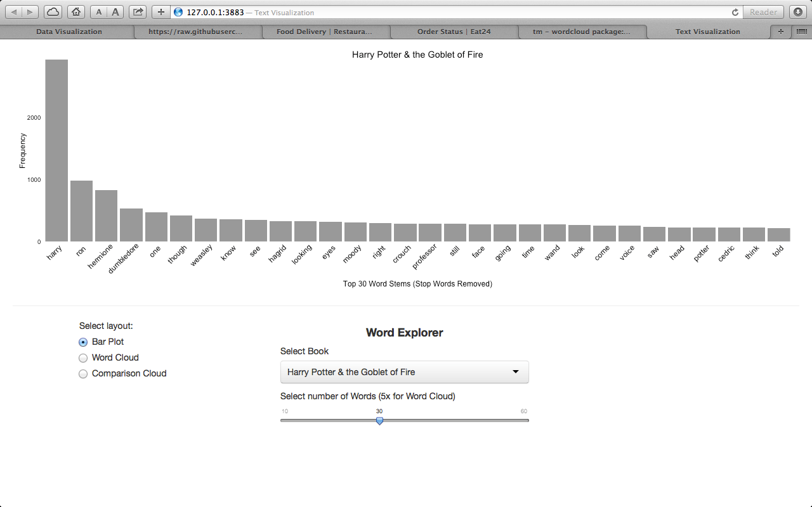
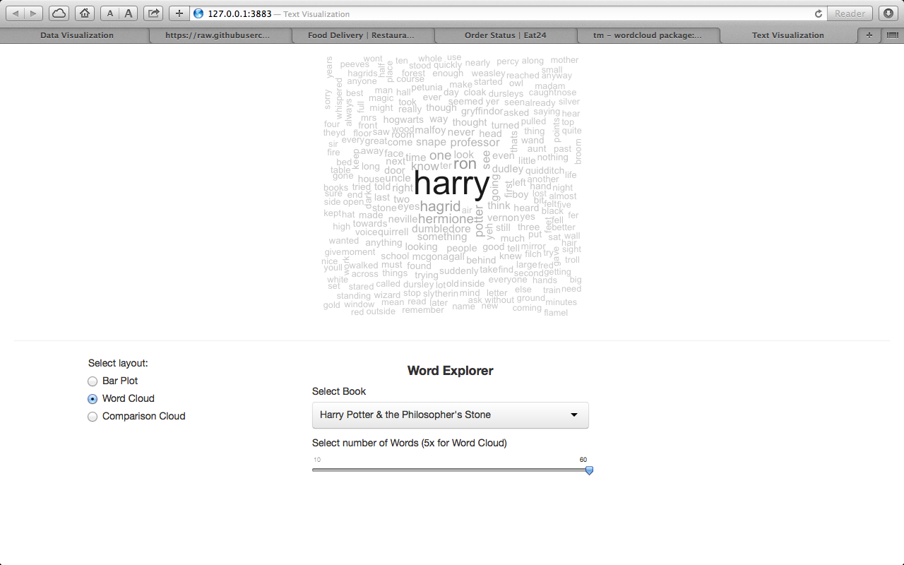
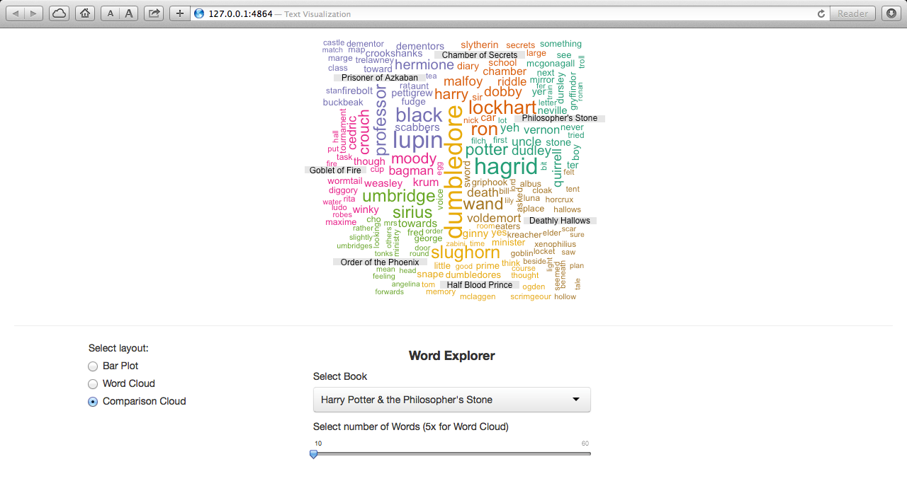

Homework 4: Text Visualization
==============================

| **Name**  | Anuj Saxena  |
|----------:|:-------------|
| **Email** | asaxena2@dons.usfca.edu |

## Instructions ##

Please install the following packages:
```
library(ggplot2)
library(wordcloud)
library(shiny)
require(tm)        
require(SnowballC)
library(grDevices)
```
Run the following:
```
shiny::runGitHub('msan622', 'anujsaxenaa', subdir='homework4')
```
## Discussion ##

To check for the most occuring words in each book. The word-slider lets you browse through up to 60 words.

In the wordcloud, the size of the word represents the frequency. The color helps us segment this more visibly.

Comparision cloud lets us compare the frequency of occurrences across all the Harry Potter books. They may take a while to appear so be patient.