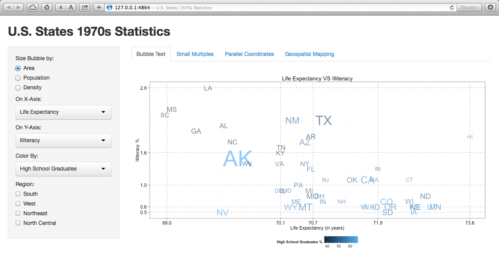
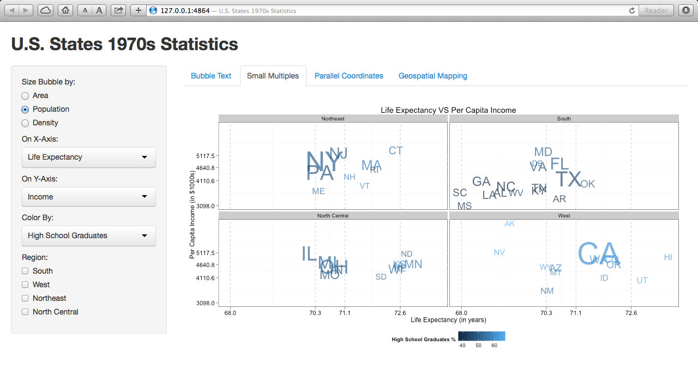
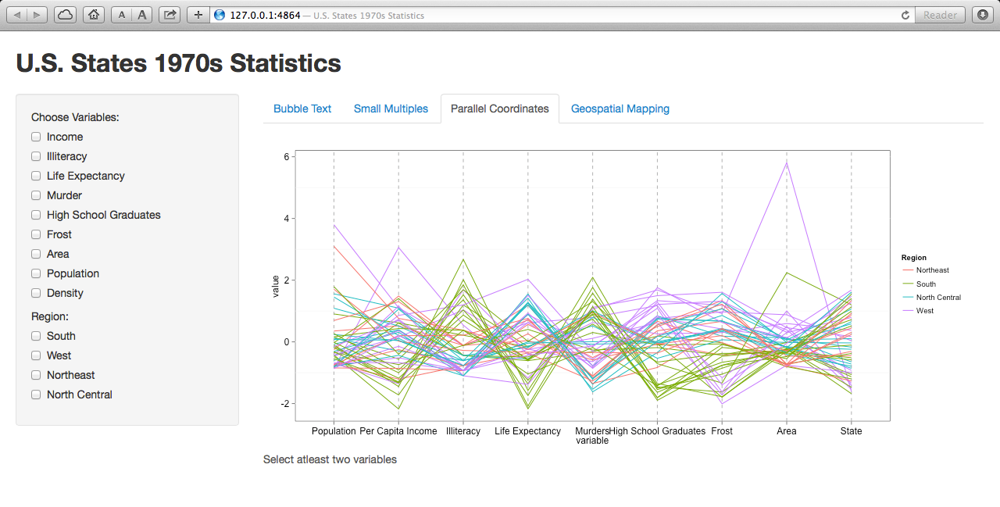
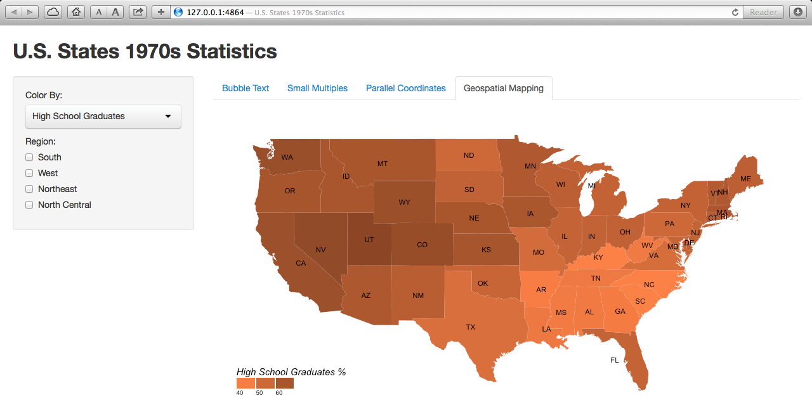

Homework 3: Multivariate 
==============================

| **Name**  | Anuj Saxena  |
|----------:|:-------------|
| **Email** | asaxena2@dons.usfca.edu |

## Instructions ##
Please install the following packages
```
library(ggplot2)
library(shiny)
library(scales)
library(maps)
library(Hmisc)
library(stringi)
library(plyr)
library(GGally)

shiny::runGitHub('msan622', 'anujsaxenaa', subdir='homework3')
```


## Discussion ##
My main goal in this assigment is to show how well we can represent data to understand the insights in it.


I used the X, Y, Color & Size measures to show all the different variables. The X & Y axis are relative to the variable selected. The breaks on the axis are in the form of 25% quantiles to show how every 25% of the data is places on the graph. 

Like the bubble plot, the same layout is shown but here using the small multiples technique.

To show how the normalized values change as the points in the graph change from variable to variable. Parallel coordinates is a good technique to do this.

Used map_data from the maps package to plot the same states dataset on the US map using the lat and long coordinates.
Used zooming to view particular and combination of regions. 
